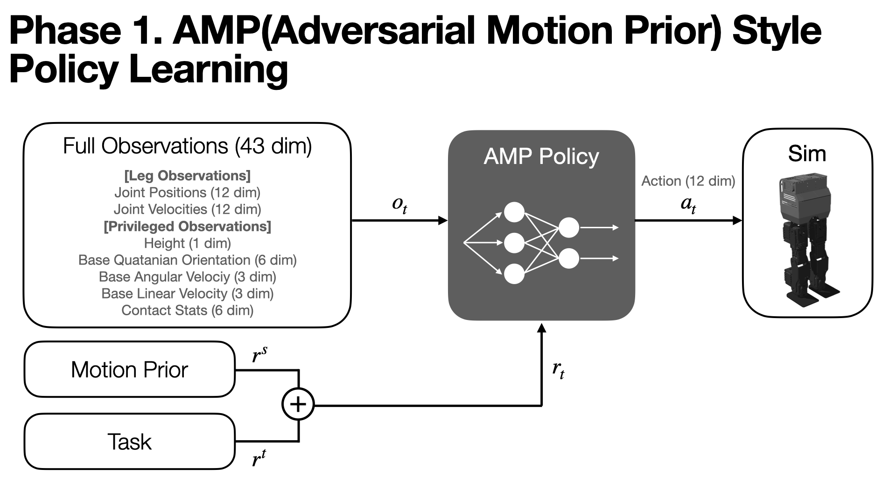
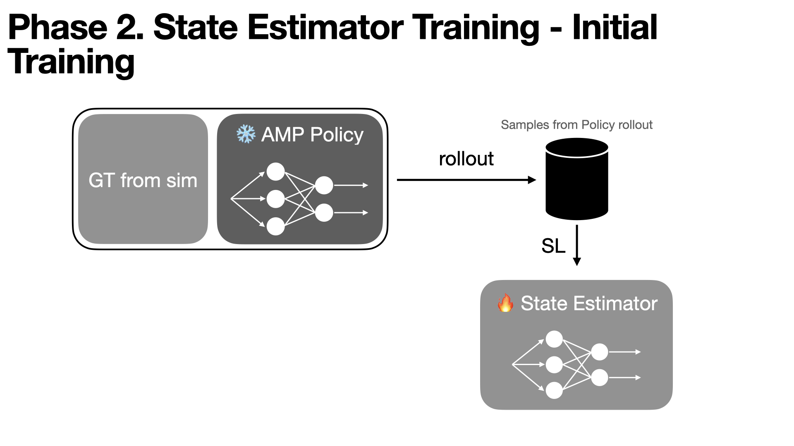
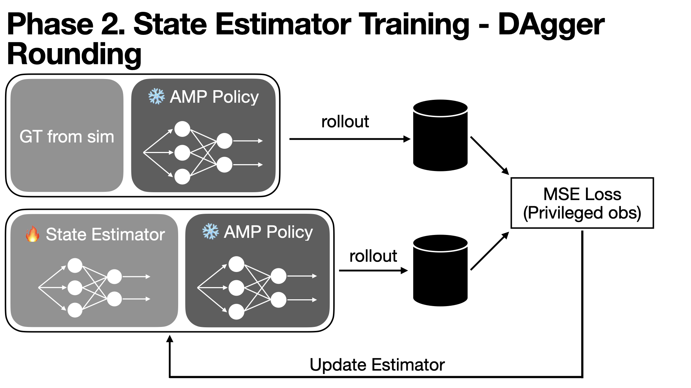
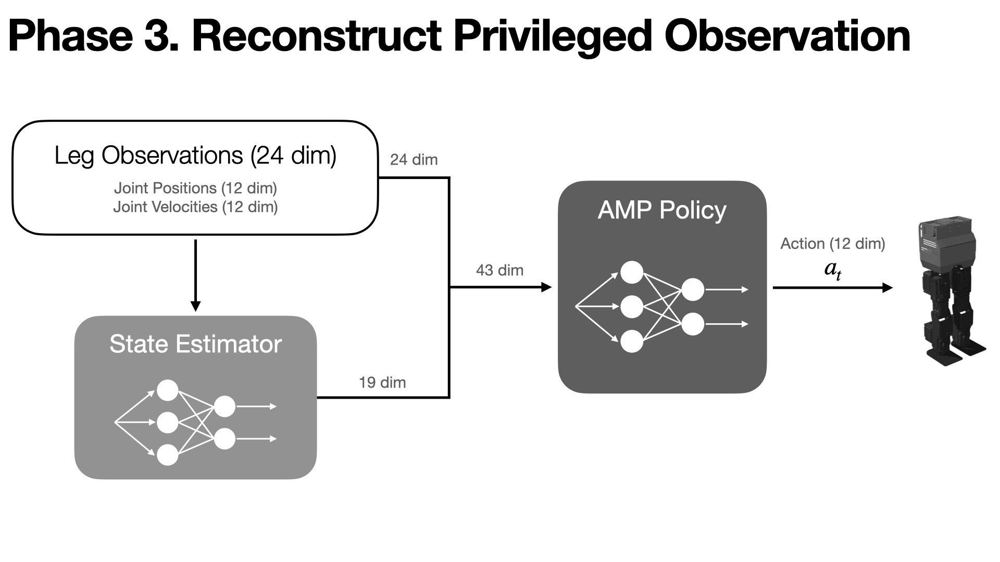

# SOLO_DEXTRA

### State Estimation with Only Leg Observations


[DEXTRA](https://github.com/edipark/SOLO_HW.git) is trained to walk from reference motions using an [AMP](https://xbpeng.github.io/projects/AMP/index.html)-style RL framework. However, the privileged policy requires base rotation and velocity information that is unavailable during hardware deployment. To address this limitation, an LSTM-based state estimator is employed to predict all states except leg joint positions.

## Phase 1


*Train a privileged AMP policy using full 43-dim observations (leg joints + privileged states) with combined motion prior and task reward.*

## Phase 2


*Collect rollouts from the frozen AMP policy and train the LSTM state estimator via supervised learning against simulator ground truth.*



*Iteratively refine the estimator with DAgger — roll out with estimated states and minimize MSE against privileged observations from the ground-truth rollout.*

## Phase 3


*At inference, the state estimator reconstructs the 19-dim privileged states from leg-only observations (24 dim), supplying the frozen AMP policy with the full 43-dim input.*


## Layout

```
source/                                 # Isaac Lab framework (trimmed)
├── isaaclab/                           # core simulation / asset / MDP API
├── isaaclab_assets/                    # robot & primitive assets
├── isaaclab_contrib/                   # contrib sensors (required by core)
├── isaaclab_rl/                        # RL wrappers (SKRL etc.)
└── isaaclab_tasks/
    └── isaaclab_tasks/direct/SOLO_DEXTRA/
        ├── dextra_amp_env.py           # DirectRLEnv implementation
        ├── dextra_amp_env_cfg.py       # env / robot / domain randomization config
        ├── dextra_robot_cfg.py         # URDF-based articulation config
        ├── actuators/ax18a.py          # AX-18A compliance + punch + damping model
        ├── agents/                     # SKRL config (skrl_amp_cfg.yaml)
        ├── motions/                    # AMP reference motion (.npz)
        ├── solo_models.py              # teacher / student / estimator networks
        ├── train_dagger.py             # DAgger student distillation
        ├── train_state_estimator.py    # privileged-state estimator training
        └── play_*, rollout_log.py, run_ablation.py, ...

scripts/reinforcement_learning/skrl/    # generic SKRL trainer/player
├── train.py
├── play.py
└── train_stiffness_curriculum.py       # SOLO_DEXTRA-specific curriculum

SOLO_ws/                                # hardware deployment workspace (Raspberry Pi)
├── deploy.py
├── export_to_onnx.py
├── config.yaml
├── hardware/dynamixel_interface.py
├── inference/onnx_policy.py, onnx_estimator.py
└── scripts/, utils/, models/

apps/                                   # Omniverse Kit launch configs
isaaclab.sh / isaaclab.bat              # launcher
pyproject.toml, environment.yml         # project & conda env
```

## Quick start

Install Isaac Sim 4.5 and set up dependencies as described in the upstream
[Isaac Lab installation guide](https://isaac-sim.github.io/IsaacLab/). Only the
dependency setup is relevant — the project code itself lives in this repo.

```bash
# train
./isaaclab.sh -p scripts/reinforcement_learning/skrl/train.py \
    --task Isaac-Dextra-Amp-Walk-Direct-v0 --headless

# play
./isaaclab.sh -p scripts/reinforcement_learning/skrl/play.py \
    --task Isaac-Dextra-Amp-Walk-Direct-v0 --checkpoint <path>

# DAgger student
./isaaclab.sh -p source/isaaclab_tasks/isaaclab_tasks/direct/SOLO_DEXTRA/train_dagger.py \
    --task Isaac-Dextra-Amp-Walk-Direct-v0 --headless
```

Registered task id: `Isaac-Dextra-Amp-Walk-Direct-v0`.

## Hardware deployment

See [SOLO_ws/README.md](SOLO_ws/README.md) for the Raspberry Pi + Dynamixel AX-18A
deployment workflow (ONNX export, real-time inference loop, sysid scripts).

## License & attribution

This project is based on [Isaac Lab](https://github.com/isaac-sim/IsaacLab) by the
Isaac Lab Project Developers, licensed under BSD-3-Clause. See [LICENSE](LICENSE)
and [CONTRIBUTORS.md](CONTRIBUTORS.md) for upstream credits.

SOLO_DEXTRA additions are released under the same BSD-3-Clause license.
